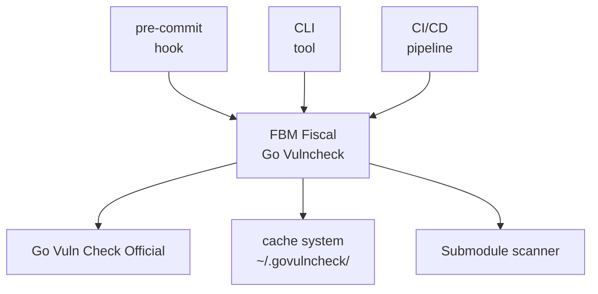

# GoVuln

<div align="center">

[](https://golang.org)
[](LICENSE)
[](https://github.com/pre-commit/pre-commit)
[](https://github.com/github.com/guionardo/govuln/actions/workflows/go.yml)

*A comprehensive vulnerability scanner for Go projects with intelligent caching and submodule support*

</div>

## 🔍 Overview

GoVuln is an enhanced wrapper around Go's official `govulncheck` tool, designed to provide comprehensive vulnerability scanning for Go projects. It offers intelligent caching, submodule scanning, and seamless integration with pre-commit hooks, making it ideal for organizations with complex Go dependency graphs.

## ✨ Features

- 🛡️ **Enhanced Vulnerability Scanning**: Wraps `govulncheck` with additional organizational-specific features
- ⚡ **Intelligent Caching**: 24-hour cache duration to avoid redundant expensive scans
- 🔄 **Submodule Support**: Automatically scans internal dependencies and git submodules
- 🎨 **Rich Output**: Beautiful table output with color coding and Markdown support
- 🪝 **Pre-commit Integration**: Seamless integration with pre-commit hooks
- 🏃‍♂️ **Performance Optimized**: Concurrent scanning with configurable limits
- 📊 **Detailed Reporting**: Comprehensive vulnerability information with fix recommendations

## 🚀 Quick Start

### Prerequisites

- Go 1.24.6 or later
- `govulncheck` installed: `go install golang.org/x/vuln/cmd/govulncheck@latest`

### Installation

#### As a Pre-commit Hook

Add this to your `.pre-commit-config.yaml`:

```yaml
repos:
  - repo: https://github.com/github.com/guionardo/govuln
    rev: v0.2.0
    hooks:
      - id: go-vulncheck
```

For warning-only mode (non-blocking):

```yaml
repos:
  - repo: https://github.com/github.com/guionardo/govuln
    rev: v0.2.0
    hooks:
      - id: go-vulncheck
        args: [-just-warn]
```

#### As a CLI Tool

```bash
go install github.com/github.com/guionardo/govuln@latest
```

Now you can use:

```bash
govuln
```

## 📖 Usage

### CLI Usage

```bash
# Basic vulnerability check
govuln

# Check specific path
govuln -path /path/to/your/project

# Warning mode (don't fail on vulnerabilities)
govuln -just-warn

# Skip submodule checking
govuln -dont-check-subs

# Output in Markdown format
govuln -use-markdown

# Clear cache
govuln -store-clear

# Show cache information
govuln -store-info
```

### Command Line Options

| Flag               | Description                                     | Default           |
| ------------------ | ----------------------------------------------- | ----------------- |
| `-alias`           | Update your shell to use an alias 'govuln'      | `false`           |
| `-dont-check-subs` | Don't check submodules                          | `false`           |
| `-internal-owner`  | Internal owner for submodule scanning           | `""`    |
| `-just-warn`       | Just warn about vulnerabilities without failing | `false`           |
| `-path`            | Path of the project to check vulnerabilities    | Current directory |
| `-store`           | Path of the store for caching checks            | `~/.govulncheck`  |
| `-store-clear`     | Clear store                                     | `false`           |
| `-store-info`      | Show store information                          | `false`           |
| `-use-markdown`    | Use Markdown for table output                   | `false`           |

## 🏗️ How It Works

### Architecture



### Scanning Process

1. **Cache Check**: Verifies if vulnerabilities were checked within the last 24 hours
2. **Main Scan**: Runs `govuln` on the primary project
3. **Submodule Discovery**: Identifies internal dependencies based on organization
4. **Concurrent Submodule Scanning**: Checks up to 8 submodules simultaneously
5. **Result Aggregation**: Combines all vulnerability findings
6. **Rich Reporting**: Displays results in formatted tables

### Caching Strategy

- **Location**: `~/.govulncheck/` (configurable)
- **Duration**: 24 hours per project
- **Content**: SBOM data, vulnerability information, and metadata
- **Benefits**: Dramatically reduces scan time for frequent checks

## 🎯 Use Cases

### Development Workflow

```bash
# Daily development check
govuln

# Before pushing changes
govuln -just-warn  # Get visibility without blocking
```

### CI/CD Integration

```bash
# In your CI pipeline
govuln -use-markdown >> security-report.md
```

### Pre-commit setup

Add this to your `.pre-commit-config.yaml` file:

```yaml
repos:
  # KEEP YOUR PREVIOUS HOOKS
  - repo: https://github.com/github.com/guionardo/govuln
    rev: v0.2.2
    hooks:
      - id: go-vulncheck-just-warn
```

### Organizational Security

```bash
# Check all internal dependencies
govuln -internal-owner your-org

# Skip internal deps for external projects
govuln -dont-check-subs
```

## 📊 Output Examples

### Success Output
```
┌─────────────────────────────────────────────────────────┐
│                    YOUR PROJECT NAME                    │
├─────────────────────────────────────────────────────────┤
│           SUCCESS!! No Vulnerabilities Found            │
│                       v1.2.3                            │
└─────────────────────────────────────────────────────────┘
```

### Vulnerability Detection
```
┌──────────────────────────────────────────────────────────────────────────────┐
│                              YOUR PROJECT NAME                               │
├─────────────┬─────────────────┬────────────┬───────────┬─────────────────────┤
│ PACKAGE     │ VULNERABILITY   │ INTRODUCED │ FIXED     │ CURRENT             │
├─────────────┼─────────────────┼────────────┼───────────┼─────────────────────┤
│ golang.org/ │ GO-2023-1234    │ v1.0.0     │ v1.2.1    │ v1.1.0              │
│ x/crypto    │                 │            │           │                     │
└─────────────┴─────────────────┴────────────┴───────────┴─────────────────────┘
```

## 🛠️ Configuration

### Environment Variables

The tool respects standard Go environment variables and automatically detects:

- Go installation path
- GOPATH and GOROOT
- User home directory for cache storage

### Cache Management

```bash
# View cache statistics
govuln -store-info

# Clear all cached data
govuln -store-clear

# Use custom cache location
govuln -store /custom/cache/path
```

## 🤝 Contributing

We welcome contributions! Please see our [Contributing Guidelines](CONTRIBUTING.md) for details.

### Development Setup

```bash
# Clone the repository
git clone https://github.com/github.com/guionardo/govuln.git
cd fury_fbm-fiscal-govulncheck

# Install dependencies
go mod download

# Run tests
go test ./...

# Build
go build -o govuln .
```

### Code Structure

```
├── internal/
│   ├── check/          # Core vulnerability checking logic
│   ├── config/         # Configuration management
│   ├── exec/           # Command execution utilities
│   ├── git/            # Git operations for submodules
│   ├── store/          # Caching system
│   └── tools/          # Utility packages
├── main.go             # CLI entry point
└── README.md          # This file
```

## 📝 License

This project is licensed under the MIT License - see the [LICENSE](LICENSE) file for details.

## 🆘 Support

- **Issues**: [GitHub Issues](https://github.com/github.com/guionardo/govuln/issues)
- **Documentation**: [Wiki](https://github.com/github.com/guionardo/govuln/wiki)

## 🙏 Acknowledgments

- Built on top of Go's official [`govulncheck`](https://pkg.go.dev/golang.org/x/vuln/cmd/govulncheck)
- Inspired by the need for comprehensive organizational vulnerability management
- Thanks to the Go security team for their excellent tooling

---

<div align="center">

**Made with ❤️ by Guionardo Furlan**

[Report Bug](https://github.com/github.com/guionardo/govuln/issues) •
[Request Feature](https://github.com/github.com/guionardo/govuln/issues) •
[Documentation](https://github.com/github.com/guionardo/govuln/wiki)

</div>
